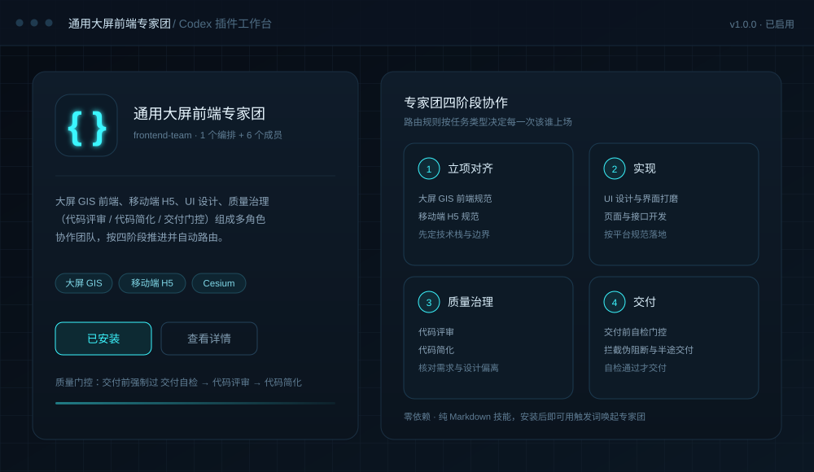

# 通用大屏前端专家团（frontend-team）

[](./LICENSE)
[](#安装)
[](#技能清单)
[](#特性)

一个面向 **大屏 GIS / 移动端 H5** 场景的前端专家团 Codex 插件：把大屏 GIS 前端、移动端 H5、UI 设计、质量与治理（代码评审 / 代码简化 / 交付门控）组织成一个多角色协作团队，按「立项对齐 → 实现 → 质量治理 → 交付」四阶段推进，并内置路由规则决定每一次该谁上场。



> 上图为插件工作台界面示意图（非真实截图）。

## 特性

- **多角色编排**：一个编排技能（`frontend-team`）统领，按任务类型自动路由到对应角色技能。
- **平台分流**：PC 大屏 GIS 与移动端 H5 使用互不混用的两套规范。
- **质量门控**：交付前强制过「交付自检 → 代码评审 → 代码简化」三道闸门。
- **零依赖**：纯 Markdown 技能与元数据，无需安装任何运行时依赖。

## 目录结构

```
frontend-team/
├── .codex-plugin/
│   └── plugin.json            # 插件清单（名称、版本、界面元数据）
├── LICENSE                    # MIT 许可
├── README.md
├── assets/                    # 插件图标与界面示意图（icon.png / logo.png / logoDark.png / preview.svg）
└── skills/                    # 全部技能
    ├── frontend-team/         # 专家团编排层（入口）
    ├── 项目级别前端开发规范/    # PC 大屏 GIS 前端规范
    ├── 手机端H5开发规范/       # 移动端 H5 / WebView 规范
    ├── ui-new__skillhub/      # UI 设计
    ├── wenwei-code-review__skillhub/  # 代码评审
    ├── code-simplification__skillhub/ # 代码简化
    └── delivery-no-pseudoblock/       # 交付前自检门控
```

## 技能清单

| 技能 | 职责 |
| --- | --- |
| `frontend-team` | 专家团编排：团队构成、四阶段工作流、路由规则、强制规则 |
| `项目级别前端开发规范` | 大屏 GIS 前端规范（Vue 3.2.47 + TS + Vite + Ant Design Vue + Cesium）：技术栈红线、目录命名、颜色变量、页面排版、接口规范、Cesium 封装、弹窗交互预设 |
| `手机端H5开发规范` | 移动端 H5 / WebView 规范：布局契约、视口与安全区、点击区、软键盘、滚动容器、localStorage 配额保护、对话式表单状态机 |
| `ui-new__skillhub` | UI 设计与生产级界面打磨（设计系统、色彩体系、布局模板、组件模式） |
| `wenwei-code-review__skillhub` | 开发后代码评审：结合功能点 / 需求 / 概要设计文档，核对需求完成度、BUG 与设计偏离 |
| `code-simplification__skillhub` | 代码简化：在不改变行为的前提下降低复杂度、提升可读性 |
| `delivery-no-pseudoblock` | 交付前全自动自检：拦截责任转嫁、半途交付、伪阻断提问等形态 |

## 安装

### 方式一：作为 Codex 插件（推荐）

1. 将本目录放到本地插件目录，例如 `~/plugins/frontend-team`。
2. 在个人市场文件 `~/.agents/plugins/marketplace.json` 中登记：

```json
{
  "name": "personal",
  "interface": { "displayName": "Personal" },
  "plugins": [
    {
      "name": "frontend-team",
      "source": { "source": "local", "path": "./plugins/frontend-team" },
      "policy": { "installation": "AVAILABLE", "authentication": "ON_INSTALL" },
      "category": "Productivity"
    }
  ]
}
```

3. 重启 Codex 客户端，在市场列表中启用 `frontend-team`。

### 方式二：作为技能直接使用

把 `skills/` 下的任意技能目录复制到 `~/.codex/skills/` 即可，其中的 `SKILL.md` 即技能入口。

## 使用

安装后，用触发词唤起专家团，例如：

- 用前端专家团帮我做一个 GIS 大屏页面
- 前端专家团，评审一下我这次的代码改动
- 移动端 H5 页面开发，按手机端 H5 规范来

`frontend-team` 会根据任务自动路由到对应角色技能；具体触发词见各技能 `SKILL.md` 的 frontmatter `description`。

## 技能触发词一览

说出下表任意一类话，就会命中对应技能；不确定用哪个时，直接说「用前端专家团帮我做…」，由编排层自动路由。

| 技能 | 触发时机 | 典型触发词 |
| --- | --- | --- |
| `frontend-team`（编排层） | 前端任务要走完「需求 → 交付」全流程，或需要多角色协作 | 前端专家团、frontend-team、大屏前端、GIS 大屏、大屏GIS前端、质量与治理 |
| `项目级别前端开发规范` | 开发大屏 GIS 项目的 Vue 页面 / 组件 / 图表 / 接口 / 地图功能，或对齐需求、诊断 Bug、沉淀文档 | 新增页面、板块开发、CesiumMap、图层交互、接口接入、修 Bug、报错、TDD、写 PRD、按项目风格、跨会话交接 |
| `手机端H5开发规范` | 移动端 H5 / WebView 页面开发与改造，或遇到移动端布局疑难 | 移动端、H5、手机端、dvh、安全区 safe-area、软键盘、双滚动条、点击区、会话恢复、localStorage 配额、防重复提交、槽位、对话下单 |
| `ui-new__skillhub` | 生成或打磨界面视觉 | 帮我做个界面、优化一下 UI、设计一个页面、Dashboard、Landing Page、组件库、设计系统 |
| `wenwei-code-review__skillhub` | 开发完成后评审代码实现 | 代码评审、代码审查、检查代码实现、核对代码与设计是否一致、验收代码质量 |
| `code-simplification__skillhub` | 代码能跑但过于复杂，想在不改变行为的前提下简化 | 代码简化、重构提升可读性、太复杂看不懂、审查累积复杂性 |
| `delivery-no-pseudoblock` | 每次交付结果前的强制终检（一般由专家团自动调用，无需手动触发） | 交付前自检、终检门控 |

**平台分流**：PC 大屏 / GIS 走 `项目级别前端开发规范`，移动端 H5 / WebView 走 `手机端H5开发规范`，两套规范互不混用——说「移动端」不会触发大屏规范，反之亦然。

## 许可

本项目基于 [MIT License](./LICENSE) 开源。